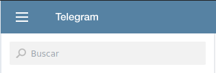
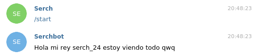

# Bot en Telegram con Nodejs y npm

## Requisitos: 

* Conocimientos en javascript
* Conocimientos minimos en node
* Tener una cuenta en Telegram

***Para saber por lo menos lo que se está haciendo!!***

# Solicitud del token: 
Para empezar debemos buscar a BotFather que es quien nos creará nuestro bot sin vida!!.
- 

Una vez estemos en el chat de botFather debemos escribir ***/newbot***, nos pedirá el nombre que queremos y luego nos dará un ***TOKEN*** para acceder a la api.

# Node:

Una vez obtenido el ***TOKEN*** nos creamos un archivo javascript y lo guardamos en una constante.
```javascript
const TOKEN = "1435xxxxxxxx:xxxxxxxxxxxxxxxxxxxxxxxxxx4qsow";
```

1. Iniciamos un nuevo paquete npm con ***npm init -y***.
2. Descargamos la librería ***telegraf*** para poder manipular al bot(***npm i telegraf***).

Lo requerimos:
```javascript
const teleg = require('telegraf');
```

Y lo inicializamos:

```javascript
const bot = new teleg.Telegraf(TOKEN);
```

# Pruebas:
> Para usar todas las funcionalidades de esta api debemos leer la documentación. [telegraf](https://telegraf.js.org/#/?id=telegraf)

## Algunas ejemplos: 

Responder cuando alguien en el chat escribe `/start`

```javascript
bot.start((ctx)=>{
    ctx.reply(`Hola mi rey ${ctx.from.username}, escribiste /start `);
});
```
Crear tu propio comando

```javascript
bot.command(['sergio','hola','no'],(ctx)=>{
    ctx.reply('comando nuevo uwu');
});
```
Responde cuando alguien escribe 'pc'

```javascript
bot.hears('pc',(ctx)=>{
    ctx.reply('escribiste pc');
});
```
por ultimo escribimos

```javascript
bot.launch();
```

Para iniciar el servidor debemos escribir:

`node nombreDeTuJS`

Nos vamos a telegram y abrimos un chat con el bot creado y escribimos:
`/start`

Vemos que responde lo que escribimos.


